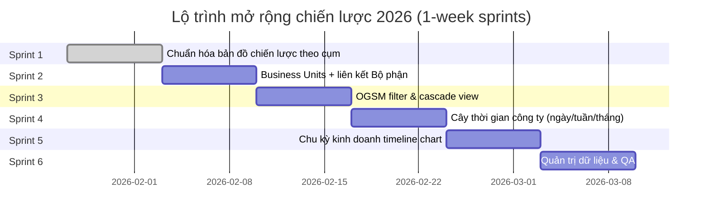

# Implementation Roadmap

## Overview

Roadmap chi tiết để implement KIDO OKR-BSC System, chia thành các phases và tasks cho AI Agents.

## Timeline Overview

```
Phase 1: Foundation (Week 1)
├── Database Schema & Types
├── Mock Data Refactoring
└── Supabase Setup

Phase 2: Core Components (Week 2)
├── Shared UI Components
├── Layout Components
└── Theme System

Phase 3: OGSM Pages (Week 3)
├── OGSM Company Page
├── OGSM Department Page
└── Strategy Map

Phase 4: Execution Pages (Week 4)
├── OKRs Board
├── KPIs Dashboard
└── CSFs Board

Phase 5: Analysis & Actions (Week 5)
├── Fishbone Analysis
├── Weekly Actions
└── Reviews

Phase 6: Integration & Polish (Week 6)
├── Dashboard
├── Real-time Updates
└── Testing & QA
```

---

## Phase 1: Foundation

### Task 1.1: Refactor Mock Data (Priority: HIGH)

**Objective:** Điều chỉnh mock-data.ts để liên kết chặt chẽ các phần với nhau.

**Files to modify:**
- `src/data/mock-data.ts`

**Requirements:**
1. Add proper ID linking between entities
2. Add `linkedGoalId` to OKRs
3. Add `linkedKpiId` to Department measures
4. Add `kpiId` to Fishbone items
5. Add `linkedGoalId` and `linkedKpiId` to Weekly Actions
6. Ensure consistency in naming and IDs

**Acceptance Criteria:**
- [ ] All entities have proper foreign key references
- [ ] Data flows from OGSM → Goals → OKRs → KPIs → Actions → Fishbone
- [ ] No orphan data (all references valid)

**Estimated Time:** 2 hours

---

### Task 1.2: Create TypeScript Types (Priority: HIGH)

**Objective:** Tạo type definitions theo Data Model spec.

**Files to create:**
```
src/types/
├── index.ts
├── base.ts
├── organization.ts
├── ogsm.ts
├── department-ogsm.ts
├── kpi.ts
├── okr.ts
├── csf.ts
├── fishbone.ts
├── weekly-actions.ts
├── review.ts
└── strategy-map.ts
```

**Requirements:**
1. Follow interfaces from `02-data-model.md`
2. Export all types from `index.ts`
3. Use proper TypeScript patterns (generics, unions, etc.)
4. Add JSDoc comments

**Acceptance Criteria:**
- [ ] All interfaces defined
- [ ] Types match database schema
- [ ] No TypeScript errors
- [ ] Can import from `@/types`

**Estimated Time:** 3 hours

---

### Task 1.3: Supabase Database Setup (Priority: HIGH)

**Objective:** Setup Supabase project và run migrations.

**Files to create:**
```
supabase/
├── config.toml
├── seed.sql
└── migrations/
    ├── 00001_create_enums.sql
    ├── 00002_create_organizations.sql
    ├── 00003_create_departments.sql
    ├── 00004_create_users.sql
    ├── 00005_create_objectives.sql
    ├── 00006_create_goals.sql
    ├── 00007_create_strategies.sql
    ├── 00008_create_kpis.sql
    ├── 00009_create_okrs.sql
    ├── 00010_create_csfs.sql
    ├── 00011_create_fishbone.sql
    ├── 00012_create_weekly_actions.sql
    ├── 00013_create_reviews.sql
    ├── 00014_create_strategy_map.sql
    └── 00015_create_indexes.sql
```

**Requirements:**
1. Follow schema from `01-database-schema.md` EXACTLY
2. **IMPORTANT**: All tables and types MUST have `okr_` prefix (e.g. `okr_users`, `okr_goals`)
3. Include RLS policies
4. Create seed data from mock-data

**Acceptance Criteria:**
- [ ] All tables created with `okr_` prefix
- [ ] Seed data inserted
- [ ] RLS policies enabled
- [ ] Supabase types generated

**Estimated Time:** 4 hours

---

### Task 1.4: Supabase Client Setup (Priority: HIGH)

**Objective:** Configure Supabase client và create query helpers.

**Files to create:**
```
src/lib/
├── supabase/
│   ├── client.ts
│   ├── server.ts
│   ├── types.ts (generated)
│   └── queries/
│       ├── ogsm.ts
│       ├── okrs.ts
│       ├── kpis.ts
│       ├── csfs.ts
│       ├── fishbone.ts
│       ├── actions.ts
│       └── reviews.ts
```

**Requirements:**
1. Client-side and server-side clients
2. Type-safe query functions
3. Error handling

**Acceptance Criteria:**
- [ ] Can connect to Supabase
- [ ] Queries return typed data
- [ ] Error handling works

**Estimated Time:** 3 hours

---

## Phase 2: Core Components

### Task 2.1: Theme System Enhancement (Priority: MEDIUM)

**Objective:** Enhance theme system với perspective colors và design tokens.

**Files to modify/create:**
```
src/lib/
├── theme.ts (enhance)
└── design-tokens.ts (new)
```

**Requirements:**
1. Perspective theme colors
2. Status colors
3. Priority colors
4. Spacing tokens
5. Typography tokens

**Acceptance Criteria:**
- [ ] Consistent colors across app
- [ ] Theme functions work properly
- [ ] Dark mode ready (optional)

**Estimated Time:** 2 hours

---

### Task 2.2: Shared UI Components (Priority: MEDIUM)

**Objective:** Create reusable UI components.

**Files to create:**
```
src/components/shared/
├── perspective-badge.tsx
├── status-badge.tsx
├── priority-badge.tsx
├── trend-indicator.tsx
├── progress-ring.tsx
├── user-avatar.tsx
├── linked-item.tsx
├── empty-state.tsx
└── loading-skeleton.tsx
```

**Requirements:**
1. Follow design system
2. Accept proper props
3. Support theming
4. Accessible (ARIA)

**Acceptance Criteria:**
- [ ] All components render correctly
- [ ] Props are properly typed
- [ ] Components are accessible

**Estimated Time:** 4 hours

---

### Task 2.3: Layout Enhancement (Priority: MEDIUM)

**Objective:** Enhance layout components (sidebar, header).

**Files to modify:**
```
src/components/layout/
├── sidebar.tsx
├── header.tsx
└── main-content.tsx
```

**Requirements:**
1. Add navigation badges (counts)
2. Breadcrumb support in header
3. Responsive sidebar
4. User menu in header

**Acceptance Criteria:**
- [ ] Sidebar shows counts/badges
- [ ] Header shows breadcrumbs
- [ ] Works on mobile

**Estimated Time:** 3 hours

---

## Phase 3: OGSM Pages

### Task 3.1: OGSM Company Page - List View (Priority: HIGH)

**Objective:** Enhance OGSM page với better linking và UI.

**Files to modify/create:**
```
src/app/ogsm/
├── page.tsx (enhance)
├── components/
│   ├── ogsm-hero-card.tsx
│   ├── objective-card.tsx
│   ├── goal-item.tsx
│   ├── strategy-item.tsx
│   └── measure-badge.tsx
```

**Requirements:**
1. Display OGSM hierarchy: O → G → S → M
2. Expandable goals with strategies
3. Clickable measures linking to KPIs
4. Progress indicators
5. Link to Department OGSM

**Acceptance Criteria:**
- [ ] Shows all 4 BSC perspectives
- [ ] Goals expand to show strategies
- [ ] Measures link to KPI page
- [ ] Progress bars work

**Estimated Time:** 4 hours

---

### Task 3.2: OGSM Company Page - Graph View (Priority: MEDIUM)

**Objective:** Create interactive graph tree view.

**Files to modify/create:**
```
src/app/ogsm/
├── interactive-graph.tsx (enhance)
├── graph-view.tsx (enhance)
└── components/
    ├── ogsm-node.tsx
    └── ogsm-edge.tsx
```

**Requirements:**
1. React Flow implementation
2. Custom nodes for O, G, S, M
3. Animated edges
4. Zoom/Pan controls
5. Click to expand details

**Acceptance Criteria:**
- [ ] Graph renders correctly
- [ ] Nodes are clickable
- [ ] Zoom/pan works
- [ ] Performance is acceptable

**Estimated Time:** 5 hours

---

### Task 3.3: OGSM Department Page (Priority: HIGH)

**Objective:** Create/enhance Department OGSM page.

**Files to modify/create:**
```
src/app/ogsm/department/
├── page.tsx (enhance)
├── components/
│   ├── department-filter.tsx
│   ├── department-table.tsx
│   ├── department-card.tsx
│   └── linked-goal-indicator.tsx
```

**Requirements:**
1. Table view with all departments
2. Filter by department/purpose
3. Show linked company goals
4. Progress tracking
5. Drill-down to department details

**Acceptance Criteria:**
- [ ] Shows all departments
- [ ] Filter works
- [ ] Shows links to company goals
- [ ] Responsive table

**Estimated Time:** 4 hours

---

### Task 3.4: Strategy Map Page (Priority: MEDIUM)

**Objective:** Enhance strategy map visualization.

**Files to modify/create:**
```
src/app/strategy-map/
├── page.tsx (enhance)
├── custom-nodes.tsx (enhance)
├── detail-panel.tsx (enhance)
├── components/
│   ├── perspective-layer.tsx
│   ├── goal-node.tsx
│   └── cause-effect-edge.tsx
```

**Requirements:**
1. 4 horizontal layers (BSC perspectives)
2. Goal nodes with status
3. Cause-effect arrows
4. Click for detail panel
5. Link nodes to actual goals

**Acceptance Criteria:**
- [ ] 4 BSC layers visible
- [ ] Nodes show status colors
- [ ] Edges show relationships
- [ ] Detail panel shows full info

**Estimated Time:** 5 hours

---

## Phase 4: Execution Pages

### Task 4.1: OKRs Page Enhancement (Priority: HIGH)

**Objective:** Enhance OKRs board với goal alignment.

**Files to modify/create:**
```
src/app/okrs/
├── page.tsx (enhance)
├── components/
│   ├── okr-kanban.tsx
│   ├── okr-card.tsx
│   ├── key-result-item.tsx
│   ├── okr-create-dialog.tsx
│   ├── okr-detail-sheet.tsx
│   └── goal-alignment-badge.tsx
```

**Requirements:**
1. Kanban by perspective
2. Drag-drop between columns
3. Show aligned company goal
4. Key results with progress
5. Create/Edit OKR dialog

**Acceptance Criteria:**
- [ ] Drag-drop works
- [ ] Shows goal alignment
- [ ] CRUD operations work
- [ ] Progress calculated from KRs

**Estimated Time:** 5 hours

---

### Task 4.2: KPIs Page Enhancement (Priority: HIGH)

**Objective:** Enhance KPIs dashboard với charts và linking.

**Files to modify/create:**
```
src/app/kpis/
├── page.tsx (enhance)
├── [id]/
│   └── page.tsx (create)
├── components/
│   ├── kpi-kanban.tsx
│   ├── kpi-card.tsx
│   ├── kpi-chart.tsx
│   ├── kpi-detail-sheet.tsx
│   └── linked-entities.tsx
```

**Requirements:**
1. Kanban by perspective
2. KPI cards with mini-chart
3. Detail view with full chart
4. Show linked goals, OKRs, departments
5. Update value functionality

**Acceptance Criteria:**
- [ ] Charts render from history
- [ ] Shows all linked entities
- [ ] Can update KPI values
- [ ] Off-track KPIs highlighted

**Estimated Time:** 5 hours

---

### Task 4.3: KPI Detail Page (Priority: MEDIUM)

**Objective:** Create dedicated KPI detail page.

**Files to create:**
```
src/app/kpis/[id]/
└── page.tsx
```

**Requirements:**
1. Full-size chart with history
2. All linked entities
3. Edit functionality
4. Link to Fishbone if off-track
5. Historical data table

**Acceptance Criteria:**
- [ ] Chart shows all history
- [ ] Can navigate to linked items
- [ ] Link to fishbone works

**Estimated Time:** 3 hours

---

### Task 4.4: CSFs Page Enhancement (Priority: MEDIUM)

**Objective:** Enhance CSFs board.

**Files to modify/create:**
```
src/app/csfs/
├── page.tsx (enhance)
├── [id]/
│   └── page.tsx (create)
├── components/
│   ├── csf-kanban.tsx
│   ├── csf-card.tsx
│   ├── csf-detail-sheet.tsx
│   └── related-okrs-list.tsx
```

**Requirements:**
1. Kanban by status
2. Priority indicators
3. Related OKRs list
4. Create/Edit dialog

**Acceptance Criteria:**
- [ ] Status-based kanban
- [ ] Shows related OKRs
- [ ] CRUD operations work

**Estimated Time:** 4 hours

---

## Phase 5: Analysis & Actions

### Task 5.1: Fishbone Page Enhancement (Priority: HIGH)

**Objective:** Enhance fishbone analysis với KPI linking.

**Files to modify/create:**
```
src/app/fishbone/
├── page.tsx (enhance)
├── fishbone-diagram.tsx (enhance)
├── components/
│   ├── fishbone-canvas.tsx
│   ├── factor-node.tsx
│   ├── problem-node.tsx
│   ├── action-items-table.tsx
│   └── kpi-selector.tsx
```

**Requirements:**
1. Link to off-track KPIs
2. Interactive fishbone diagram
3. Factor filtering
4. Action items with status
5. Create fishbone from KPI

**Acceptance Criteria:**
- [ ] Shows which KPI is being analyzed
- [ ] Diagram is interactive
- [ ] Action items trackable
- [ ] Can create new items

**Estimated Time:** 5 hours

---

### Task 5.2: Weekly Actions Page Enhancement (Priority: MEDIUM)

**Objective:** Enhance actions page với goal/KPI linking.

**Files to modify/create:**
```
src/app/actions/
├── page.tsx (enhance)
├── components/
│   ├── solution-card.tsx
│   ├── week-group.tsx
│   ├── action-card.tsx
│   ├── action-create-dialog.tsx
│   └── linked-items.tsx
```

**Requirements:**
1. Solution thinking emphasis
2. Group by week
3. Link to goals and KPIs
4. Status tracking
5. Create action dialog

**Acceptance Criteria:**
- [ ] Grouped by week
- [ ] Shows linked goal/KPI
- [ ] CRUD works
- [ ] Solution field emphasized

**Estimated Time:** 4 hours

---

### Task 5.3: Reviews Page Enhancement (Priority: LOW)

**Objective:** Enhance reviews page với checklist.

**Files to modify/create:**
```
src/app/reviews/
├── page.tsx (enhance)
├── components/
│   ├── review-card.tsx
│   ├── checklist-item.tsx
│   ├── participants-list.tsx
│   └── past-reviews.tsx
```

**Requirements:**
1. Weekly and Monthly tabs
2. Checklist functionality
3. Participants display
4. Past reviews history
5. Start review button

**Acceptance Criteria:**
- [ ] Checklists work
- [ ] Shows past reviews
- [ ] Can start a review

**Estimated Time:** 3 hours

---

## Phase 6: Integration & Polish

### Task 6.1: Dashboard Page (Priority: HIGH)

**Objective:** Create comprehensive dashboard.

**Files to modify/create:**
```
src/app/
├── page.tsx (enhance)
├── components/
│   ├── stats-cards.tsx
│   ├── perspective-chart.tsx
│   ├── quick-actions.tsx
│   ├── okr-mini-kanban.tsx
│   └── alerts-list.tsx
```

**Requirements:**
1. Summary stats cards
2. Progress by perspective chart
3. Quick actions (off-track items)
4. Mini OKR kanban
5. Upcoming reviews

**Acceptance Criteria:**
- [ ] All stats accurate
- [ ] Charts render correctly
- [ ] Links work
- [ ] Real-time data

**Estimated Time:** 5 hours

---

### Task 6.2: Real-time Updates (Priority: MEDIUM)

**Objective:** Add Supabase real-time subscriptions.

**Files to create:**
```
src/hooks/
├── use-realtime-okrs.ts
├── use-realtime-kpis.ts
├── use-realtime-actions.ts
└── use-supabase.ts
```

**Requirements:**
1. Subscribe to table changes
2. Update UI automatically
3. Handle connection errors
4. Optimistic updates

**Acceptance Criteria:**
- [ ] Changes reflect immediately
- [ ] No flickering
- [ ] Error handling works

**Estimated Time:** 4 hours

---

### Task 6.3: Testing & QA (Priority: HIGH)

**Objective:** Test all features and fix bugs.

**Files to create:**
```
__tests__/
├── components/
├── pages/
├── hooks/
└── utils/
```

**Requirements:**
1. Unit tests for utilities
2. Component tests
3. Integration tests
4. E2E tests (Playwright)

**Acceptance Criteria:**
- [ ] 80%+ coverage
- [ ] No critical bugs
- [ ] All flows work

**Estimated Time:** 5 hours

---

## Task Assignment for AI Agents

### Agent 1: Data Layer
- Task 1.1: Refactor Mock Data
- Task 1.2: Create TypeScript Types
- Task 1.3: Supabase Database Setup
- Task 1.4: Supabase Client Setup

### Agent 2: UI Foundation
- Task 2.1: Theme System Enhancement
- Task 2.2: Shared UI Components
- Task 2.3: Layout Enhancement

### Agent 3: OGSM Module
- Task 3.1: OGSM Company Page - List View
- Task 3.2: OGSM Company Page - Graph View
- Task 3.3: OGSM Department Page
- Task 3.4: Strategy Map Page

### Agent 4: Execution Module
- Task 4.1: OKRs Page Enhancement
- Task 4.2: KPIs Page Enhancement
- Task 4.3: KPI Detail Page
- Task 4.4: CSFs Page Enhancement

### Agent 5: Analysis Module
- Task 5.1: Fishbone Page Enhancement
- Task 5.2: Weekly Actions Page Enhancement
- Task 5.3: Reviews Page Enhancement

### Agent 6: Integration
- Task 6.1: Dashboard Page
- Task 6.2: Real-time Updates
- Task 6.3: Testing & QA

---

## Dependencies

```
Task 1.1 → Task 1.2 → Task 1.4
                   ↘
Task 1.3 ───────────→ Task 1.4

Task 2.1 ┐
Task 2.2 ├→ All Phase 3-6 Tasks
Task 2.3 ┘

Task 3.1 → Task 3.2
Task 3.1 → Task 3.3 → Task 3.4

Task 4.1 ↔ Task 4.2 (share components)
Task 4.2 → Task 4.3
Task 4.2 → Task 5.1 (fishbone links to KPIs)

Task 5.1 ↔ Task 5.2 (share action components)

All Tasks → Task 6.1 (dashboard needs all data)
All Tasks → Task 6.3 (testing all features)
```

---

## Definition of Done

Each task is complete when:

1. ✅ Code is implemented according to spec
2. ✅ TypeScript types are correct (no errors)
3. ✅ UI matches design (responsive)
4. ✅ Data links work correctly
5. ✅ No console errors
6. ✅ Basic tests pass
7. ✅ Code is committed

---

## Quick Start Commands

```bash
# Install dependencies
pnpm install

# Run development server
pnpm dev

# Generate Supabase types
pnpm supabase gen types typescript --local > src/lib/supabase/types.ts

# Run tests
pnpm test

# Build
pnpm build
```

---

## Phase 7: Mở rộng chiến lược 2026 (Estimate)

### Epic 7.1: Chuẩn hóa Bản đồ chiến lược theo cụm chiến lược
**Mục tiêu:** Chuẩn hóa dữ liệu mục tiêu theo cụm chiến lược F/C/P/L và đồng bộ chuỗi O → G → S → M.

**User Stories:**
- **US7.1-1 – Chuẩn hóa mục tiêu theo cụm chiến lược**: Với vai trò Chủ sở hữu chiến lược, tôi muốn lưu mã cụm, nhóm cụm, mục đích và mục tiêu để phản ánh đúng cấu trúc Bản đồ chiến lược.
- **US7.1-2 – Quản lý cách làm & đo lường theo chuẩn OGSM**: Với vai trò PM, tôi muốn quản lý “Cách làm” ở Strategy và “Đo lường” ở Strategy Measures để một mục tiêu có thể có nhiều cách làm/KPI.
- **US7.1-3 – Nhập liệu từ mẫu chuẩn BAN DO CL**: Với vai trò Admin, tôi muốn import dữ liệu từ file BAN DO CL để khởi tạo nhanh bản đồ chiến lược.
- **US7.1-4 – Hiển thị dạng bảng theo mẫu Excel**: Với vai trò Executive, tôi muốn xem bản đồ chiến lược dạng bảng giống Excel để đối chiếu nhanh.

**Estimate:** Sprint 1 (Hoàn thành, 1 tuần).

---

### Epic 7.2: Phân cấp chiến lược theo Ngành (BU) và Bộ phận
**Mục tiêu:** Thiết lập phân cấp Company → BU → Department cho OGSM và Objectives.

**User Stories:**
- **US7.2-1 – Quản trị danh mục BU**: Với vai trò Admin, tôi muốn quản lý danh sách BU làm chuẩn phân cấp chiến lược.
- **US7.2-2 – Liên kết bộ phận với BU**: Với vai trò Admin, tôi muốn gán bộ phận vào BU để đảm bảo ownership rõ ràng.
- **US7.2-3 – Gán mục tiêu theo BU và bộ phận thực thi**: Với vai trò Strategy Owner, tôi muốn gán mục tiêu theo BU và bộ phận để thể hiện chiến lược cấp ngành và cấp thực thi.
- **US7.2-4 – Báo cáo và theo dõi theo cấp**: Với vai trò Executive, tôi muốn lọc OGSM theo Company/BU/Bộ phận để theo dõi hiệu quả đúng phạm vi.

**Estimate:** Sprint 2–3 (2 tuần).

---

### Epic 7.3: Cây thời gian công ty (View ngày/tuần/tháng)
**Mục tiêu:** Hiển thị tiến độ theo ngày/tuần/tháng dựa trên `okr_goals` và `okr_strategies`, dữ liệu cấu hình chỉ lưu ngày bắt đầu/kết thúc.

**User Stories:**
- **US7.3-1 – Timeline linh hoạt theo ngày/tuần/tháng**: Với vai trò PM, tôi muốn xem timeline theo ngày/tuần/tháng dựa trên `start_date/end_date` của goals/strategies.
- **US7.3-2 – Lọc và chuyển chế độ xem**: Với vai trò User, tôi muốn chuyển chế độ xem theo ngày/tuần/tháng và lọc theo khoảng thời gian.
- **US7.3-3 – Theo dõi tiến độ thực tế**: Với vai trò Executive, tôi muốn nhìn thấy tiến độ thực tế so với kế hoạch trên timeline.

**Estimate:** Sprint 4 (1 tuần).

---

### Epic 7.4: Chu kỳ kinh doanh (Timeline chart)
**Mục tiêu:** Hiển thị chu kỳ kinh doanh theo phase dưới dạng timeline.

**User Stories:**
- **US7.4-1 – Quản trị phase chu kỳ kinh doanh**: Với vai trò Admin, tôi muốn quản lý danh sách phase để cập nhật chu kỳ theo năm.
- **US7.4-2 – Xem chu kỳ theo timeline**: Với vai trò Executive, tôi muốn xem phase theo timeline để bám sát nhịp vận hành.
- **US7.4-3 – Liên kết phase với mục tiêu trọng tâm**: Với vai trò PM, tôi muốn liên kết phase với objectives/goals để nắm trọng tâm theo giai đoạn.

**Estimate:** Sprint 5 (1 tuần).

---

### Epic 7.5: Quản trị dữ liệu & QA
**Mục tiêu:** Bảo đảm dữ liệu đầy đủ, nhất quán và hiển thị đúng.

**User Stories:**
- **US7.5-1 – Kiểm tra tính đầy đủ dữ liệu chiến lược**: Với vai trò Admin, tôi muốn kiểm tra dữ liệu BU/Objective/Goal/Strategy trước khi rollout.
- **US7.5-2 – Checklist QA cho OGSM & Timeline**: Với vai trò PM, tôi muốn có checklist QA cho OGSM, Timeline và Chu kỳ kinh doanh.

**Estimate:** Sprint 6 (1 tuần).

---

## Estimated Sprint Timeline (1-week sprints)

- Sprint 1: Chuẩn hóa Bản đồ chiến lược theo cụm (Hoàn thành)
- Sprint 2: Business Units schema + liên kết Bộ phận/Objectives
- Sprint 3: OGSM filter & cascade view
- Sprint 4: Cây thời gian công ty (ngày/tuần/tháng)
- Sprint 5: Chu kỳ kinh doanh timeline chart
- Sprint 6: Quản trị dữ liệu & QA


